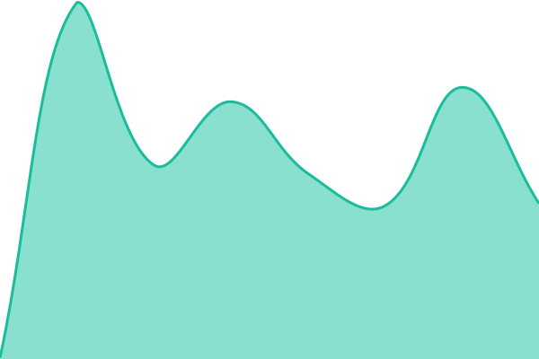
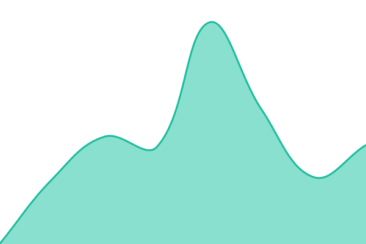

# [📈 Live Status](https://hlds-run.github.io/upptime/): <!--live status--> **🟩 All systems operational**

This repository contains the open-source uptime monitor and status page for [HLDS.run](https://hlds-run.github.io/upptime/), powered by [Upptime](https://github.com/upptime/upptime).

We use [Issues](https://github.com/hlds-run/upptime/issues) as incident reports, [Actions](https://github.com/hlds-run/upptime/actions) as uptime monitors, and [Pages](https://hlds-run.github.io/upptime/) for the status page.

<!--start: status pages-->
<!-- This summary is generated by Upptime (https://github.com/upptime/upptime) -->
<!-- Do not edit this manually, your changes will be overwritten -->
<!-- prettier-ignore -->
| URL | Status | History | Response Time | Uptime |
| --- | ------ | ------- | ------------- | ------ |
|  [HLDS.run](https://hlds.run) | 🟩 Up | [hlds-run.yml](https://github.com/hlds-run/upptime/commits/HEAD/history/hlds-run.yml) | 

 647ms
     
 | 

<a href="https://hlds-run.github.io/upptime/history/hlds-run">100.00%</a>
    

|  [ru.hlds.run](https://ru.hlds.run) | 🟩 Up | [ru-hlds-run.yml](https://github.com/hlds-run/upptime/commits/HEAD/history/ru-hlds-run.yml) | 

 4984ms
     
 | 

<a href="https://hlds-run.github.io/upptime/history/ru-hlds-run">96.27%</a>
    

|  [docs.HLDS.run](https://docs.hlds.run) | 🟩 Up | [docs-hlds-run.yml](https://github.com/hlds-run/upptime/commits/HEAD/history/docs-hlds-run.yml) | 

 182ms
     
 | 

<a href="https://hlds-run.github.io/upptime/history/docs-hlds-run">95.08%</a>
    

<!--end: status pages-->
