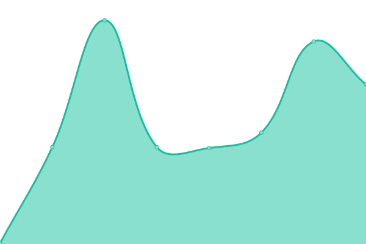

# [📈 Live Status](https://hlds-run.github.io/upptime/): <!--live status--> **🟩 All systems operational**

This repository contains the open-source uptime monitor and status page for [HLDS.run](https://hlds-run.github.io/upptime/), powered by [Upptime](https://github.com/upptime/upptime).

We use [Issues](https://github.com/hlds-run/upptime/issues) as incident reports, [Actions](https://github.com/hlds-run/upptime/actions) as uptime monitors, and [Pages](https://hlds-run.github.io/upptime/) for the status page.

<!--start: status pages-->
<!-- This summary is generated by Upptime (https://github.com/upptime/upptime) -->
<!-- Do not edit this manually, your changes will be overwritten -->
<!-- prettier-ignore -->
| URL | Status | History | Response Time | Uptime |
| --- | ------ | ------- | ------------- | ------ |
|  [Google](https://www.google.com) | 🟩 Up | [google.yml](https://github.com/hlds-run/upptime/commits/HEAD/history/google.yml) | 

 91ms
     
 | 

<a href="https://hlds-run.github.io/upptime/history/google">100.00%</a>
    

|  [rehlds.dev](https://rehlds.dev) | 🟩 Up | [rehlds-dev.yml](https://github.com/hlds-run/upptime/commits/HEAD/history/rehlds-dev.yml) | 

 239ms
     
 | 

<a href="https://hlds-run.github.io/upptime/history/rehlds-dev">100.00%</a>
    

|  [goldsrc.ru](https://goldsrc.ru) | 🟩 Up | [goldsrc-ru.yml](https://github.com/hlds-run/upptime/commits/HEAD/history/goldsrc-ru.yml) | 

 1728ms
     
 | 

<a href="https://hlds-run.github.io/upptime/history/goldsrc-ru">100.00%</a>
    

<!--end: status pages-->
